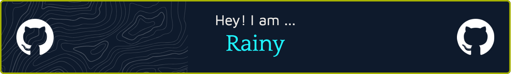

<p align="center">
  Full Stack Developer | Open Source Enthusiast | Lifelong Learner
</p>

---

[](https://moon-svg.minung.dev)

---

### 🧑‍💻 About Me

- 💼 Focused on full stack development, proficient in Java, Python, Go, Rust, JavaScript, MySQL, distributed systems, Android & iOS & HarmonyOS, React, Flutter, Vue, Node.js
- 📝 Sharing my tech journey and growth: [CSDN Blog (Chinese)](https://blog.csdn.net/qq_15807167)

---

### 📫 Contact

[](https://blog.csdn.net/qq_15807167)
[](mailto:houshuai0816@gmail.com)

<!-- Add more social links if needed -->

---

### 🛠 Tech Stack

<p align="left">
  
  
  
  
  
  
  
  
  
  
  
  
  
  
  
  
  
  
  
  
  
  
  
  
  
  
  
  
  
  
</p>

---

### 📊 Coding Stats

<!--START_SECTION:waka-->

```txt
From: 29 July 2025 - To: 05 August 2025

Java              17 hrs 12 mins  ████████████▒░░░░░░░░░░░░   48.68 %
Markdown          6 hrs 46 mins   ████▓░░░░░░░░░░░░░░░░░░░░   19.15 %
TypeScript        4 hrs 12 mins   ███░░░░░░░░░░░░░░░░░░░░░░   11.88 %
MDX               1 hr 29 mins    █░░░░░░░░░░░░░░░░░░░░░░░░   04.24 %
Python            1 hr 11 mins    █░░░░░░░░░░░░░░░░░░░░░░░░   03.35 %
```

<!--END_SECTION:waka-->


---

### 📈 GitHub Activity Graph

[](https://github.com/Ashutosh00710/github-readme-activity-graph)

---

Thank you for visiting! ⭐️
